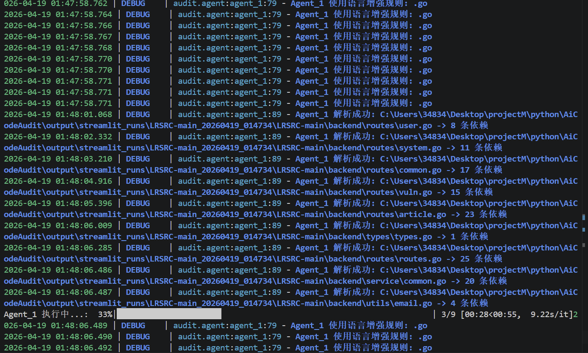
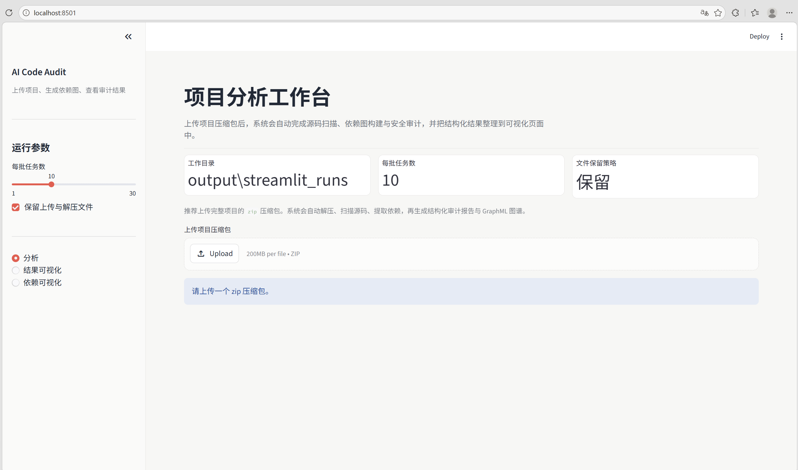
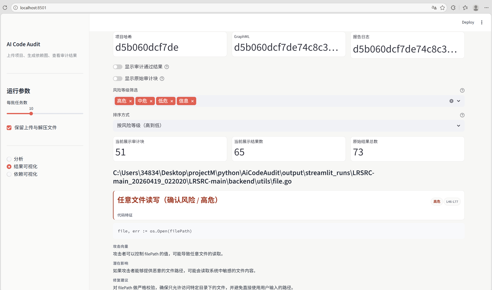
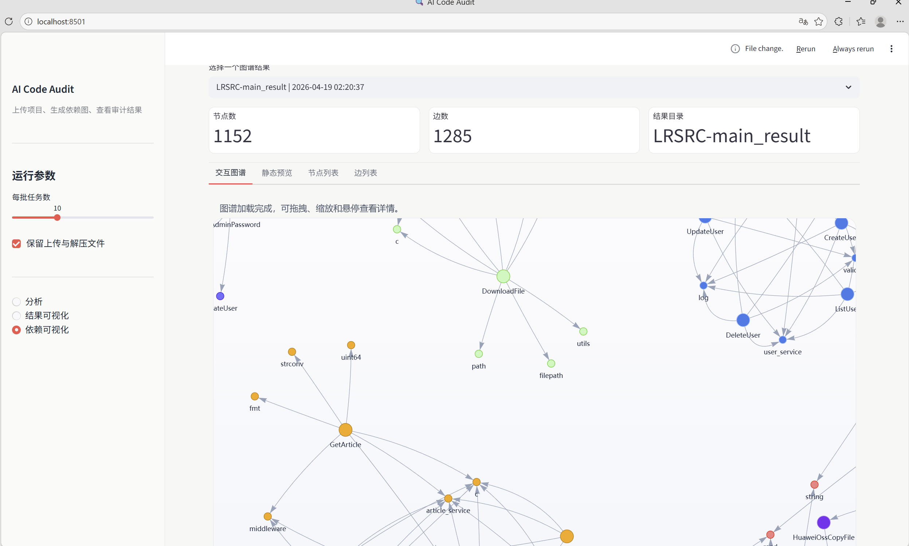

# AI Code Audit

一个基于大模型的代码安全审计工具，支持命令行和 Streamlit Web 界面两种使用方式。项目会先提取源码中的显式依赖关系，构建调用图，再结合局部子图上下文做安全审计，输出结构化审计报告和依赖图谱。





## 功能概览

- 多语言源码扫描：支持 `.py`、`.go`、`.js`、`.java`、`.cpp`、`.php`、`.c`、`.cs` 等常见源码文件
- Tree-sitter + AI 依赖提取：优先基于 Tree-sitter 静态提取显式调用关系，失败时再回退到大模型，生成 `GraphML` 依赖图
- AI 安全审计：基于局部调用上下文识别高置信度漏洞，降低误报
- 结构化报告：审计结果采用稳定标签结构，便于解析、展示和后续扩展
- Web 可视化：支持上传项目压缩包，一键分析、结果列表查看、依赖图谱展示
- 稳定性增强：支持 OpenAI 调用超时、重试、并发信号量和失败隔离
- 性能优化：避免全路径枚举，使用局部子图审计；BFS 改为 `deque`；减少无意义日志

## 最新版更新日志

- Token 预算配置收敛为 `openai.max_input_tokens`，程序会自动预留提示词与协议开销并推导源码分片预算
- 新增 `openai.request_overhead_tokens` 配置，用于为 system prompt、角色字段与请求包装预留 token
- 新增请求体本地 token 预检，超过模型输入上限时会在本地直接报错，避免频繁触发上游 `tokens_limit_reached`
- 增强小上下文模型兼容性，`Agent_1` 会自动收缩源码分片预算，`Agent_2` 会在超限时自动缩小局部子图上下文
- 优化非 OpenAI 官方模型的 tokenizer 兼容逻辑，`qwen`、`deepseek` 等模型会自动回退到兼容编码并缓存结果，减少重复告警
- 新增 `Agent_2` 失败率保护：当大模型请求失败比例过高时，结果会标记为“审计不完整”，避免把网络故障误判为“审计通过”
- 新增 Streamlit Web 服务，支持上传项目 `zip` 压缩包后直接执行分析
- 侧边栏升级为 `分析`、`结果可视化`、`依赖可视化` 三个功能页，便于分步骤查看结果
- 修复审计日志文件缺失时的读取报错，增强结果页容错能力
- 优化依赖图谱展示，补充交互图谱、静态预览、节点列表、边列表等多种查看方式
- 修复静态预览中文乱码问题，提升中文环境下的可读性
- 优化结果页渲染逻辑，默认隐藏大量“审计通过”块，缓解点击结果时的卡顿问题
- 审计报告升级为结构化标签格式，前端解析更稳定，也兼容旧版半结构化日志
- 新增“确认风险 / 可疑风险 / 审计通过”分层输出，减少“全是通过”导致的信息缺失
- 强化安全提示词，重点关注输入源、危险点、校验/鉴权信号，降低误报并提升分析专业度
- 增强 OpenAI 调用稳定性，支持超时、重试、退避、并发信号量与失败隔离
- 修复并发场景下 Semaphore 绑定事件循环导致的调用异常
- 优化扫描与切片策略，改为按 token 分片并保留原始行号偏移
- 缓存策略由路径/目录维度改为内容哈希，提升重复分析时的稳定性
- Agent_2 改为围绕局部子图进行审计，避免全路径枚举带来的上下文冗余
- BFS 遍历改用 `deque`，同时减少无意义日志输出，整体性能更稳定
- 引入 Tree-sitter 静态依赖提取能力，并支持通过配置选择 `auto`、`ast`、`llm` 解析引擎
- 新增 `pyproject.toml` 支持，可使用 `pip install -e .` 安装项目，并与 `requirements.txt` 保持一致

## 技术原理

项目整体分为两个阶段。第一阶段会扫描项目目录，读取源码与配置文件，并按 token 对源码做切片，保留原始行号偏移。对于 `.py`、`.js`、`.ts`、`.java`、`.go`、`.php`、`.c`、`.cpp`、`.cs` 等语言，系统会优先使用 Tree-sitter 做静态依赖提取；若当前环境未安装语法依赖或静态解析失败，再回退到 Agent_1 进行大模型提取，最终构建项目调用图。第二阶段会围绕图中的节点提取局部子图上下文，而不是枚举整条全路径，再交给 Agent_2 判断是否存在“外部输入 -> 危险操作 -> 缺少校验/转义/鉴权”的真实漏洞链路。最终输出 `graphml` 依赖图和结构化审计报告，供命令行或 Streamlit 页面展示。

## 项目结构

```text
AiCodeAudit/
├─ audit/                         # 审计核心流程
│  ├─ __init__.py
│  ├─ agent.py                    # Agent_1 / Agent_2 调度与模型调用
│  ├─ scaner.py                   # 项目扫描、分片与文件遍历
│  ├─ service.py                  # 审计主流程、图生成、报告输出
│  ├─ tool.py                     # 局部子图、静态安全线索提取
│  └─ tree_sitter_parser.py       # Tree-sitter 多语言静态依赖解析
├─ config/                        # 配置加载与默认配置生成
│  ├─ __init__.py
│  └─ config.py
├─ models/                        # Pydantic 数据模型
│  └─ __init__.py
├─ prompt/                        # Agent 提示词模板
│  └─ __init__.py
├─ utils/                         # 通用工具函数、代码单元解析、图构建
│  └─ __init__.py
├─ image/                         # README / Web 展示图片资源
├─ output/                        # 审计输出目录
│  └─ streamlit_runs/             # Web 模式工作目录
│     ├─ uploads/                # 上传的 zip 包
│     ├─ extracted/              # 解压后的项目目录
│     └─ results/                # 审计结果目录（项目名_时间戳）
├─ 演示项目/                      # 本地演示样例项目
├─ app.py                         # Streamlit Web 服务入口
├─ main.py                        # 命令行入口
├─ config.example.yaml            # 配置示例
├─ config.yaml                    # 实际运行配置
├─ requirements.txt               # Python 依赖
└─ README.md
```

## 安装

1. 克隆项目

```bash
git clone https://github.com/xy200303/AiCodeAudit.git
cd AiCodeAudit
```

2. 安装依赖

```bash
pip install -r requirements.txt
```

或者使用 `pyproject.toml` 方式安装当前项目：

```bash
pip install -e .
```

当前项目以 `requirements.txt` 作为依赖单一事实来源，`pyproject.toml` 会直接读取这份依赖列表，因此日后新增或调整依赖时只需要维护 `requirements.txt`。

如果你需要启用 Tree-sitter 静态依赖提取，请保持 `requirements.txt` 中的版本组合不变。当前项目使用的是已验证兼容的组合：`tree-sitter==0.21.3` 与 `tree-sitter-languages==1.10.2`。

3. 准备配置文件

```bash
copy config.example.yaml config.yaml
```

然后在 `config.yaml` 中填写你自己的 OpenAI 兼容接口配置，例如：

- `openai.api_key`
- `openai.base_url`
- `openai.model`
- `openai.timeout_seconds`
- `openai.max_retries`
- `openai.retry_backoff_seconds`
- `openai.max_concurrency`

## 命令行使用

### 基本命令

```bash
python main.py -d <target_dir> -o <output_dir> -b <batch_size>
```

如果通过 `pyproject.toml` 安装了项目，也可以直接使用：

```bash
aicodeaudit -d <target_dir> -o <output_dir> -b <batch_size>
```

### 参数说明

- `-d`：待审计项目目录，默认 `./演示项目/openssh-9.9p1`
- `-o`：输出目录，默认 `./output`
- `-b`：每批任务数，默认 `10`

### 示例

```bash
# 使用默认示例项目
python main.py

# 审计指定项目
python main.py -d ./your-project -o ./audit-results

# 调整每批任务数
python main.py -d ./your-project -b 5
```

## Web 使用

启动 Streamlit 服务：

```bash
streamlit run app.py
```

启动后可在侧边栏使用三个功能页：

- `分析`：上传项目 `zip` 压缩包并执行审计
- `结果可视化`：按结果列表查看结构化漏洞信息
- `依赖可视化`：查看交互式依赖图、静态预览、节点列表和边列表

### Web 页面说明

- 支持上传 `zip` 压缩包自动解压并分析
- 支持设置每批任务数
- 支持保留或清理上传与解压的中间文件
- 审计结果页默认不展开原始审计块，以减少大量结果时的卡顿

## 输出结果

每次分析完成后，输出目录中通常会生成以下文件：

- `<project_hash>.graphml`：项目依赖关系图
- `<project_hash>_审计结果.log`：结构化审计报告

如果使用 Web 模式，结果默认输出到：

```text
output/streamlit_runs/results/
```

Web 模式下的目录组织如下：

- `output/streamlit_runs/uploads/`：上传的压缩包
- `output/streamlit_runs/extracted/`：解压后的项目目录
- `output/streamlit_runs/results/`：审计结果目录
- 每次结果目录会按 `项目名_时间戳` 命名，例如 `LRSRC-main_20260420_174200`

## 审计报告格式

当前审计报告已改为更稳定的结构化标签格式，便于前端解析和后续扩展。典型格式如下：

```text
<审计报告>
<文件>
路径: /src/user/login.py
结论: 存在风险
<漏洞>
类型: SQL注入
等级: 高危
位置: L47-L49
<代码特征>
cursor.execute("SELECT * FROM users WHERE name = '" + username + "'")
</代码特征>
<攻击向量>
攻击者控制 username 并进入 SQL 拼接语句。
</攻击向量>
<潜在影响>
可导致任意用户数据查询和认证绕过。
</潜在影响>
<修复建议>
改为参数化查询，禁止字符串拼接 SQL。
</修复建议>
</漏洞>
</文件>
</审计报告>
```

未发现明确风险时，输出为：

```text
<审计报告>
<结论>审计通过</结论>
</审计报告>
```

如果 `Agent_2` 阶段因网络或代理问题出现较高比例请求失败，输出会改为：

```text
<审计报告>
<结论>审计不完整</结论>
<统计>
总任务数: 100
失败任务数: 45
失败率: 45.00%
阈值: 30.00%
</统计>
<说明>
本次 Agent_2 审计阶段存在较高比例的大模型请求失败，当前结果不应视为“审计通过”。
</说明>
</审计报告>
```

## 配置说明

`config.yaml` 中主要包含两类配置：

### OpenAI 配置

- `api_key`：接口密钥
- `base_url`：OpenAI 或兼容接口地址
- `max_input_tokens`：单次请求允许的最大输入 token，程序会自动扣除提示词和请求包装开销，再推导源码分片预算
- `request_overhead_tokens`：为 system prompt、角色字段、协议包装等额外成本预留的 token 数，默认 `512`
- `model`：使用的模型名称
- `timeout_seconds`：单次请求超时秒数
- `max_retries`：失败重试次数
- `retry_backoff_seconds`：重试退避基线秒数
- `max_concurrency`：并发上限

关于 token 预算，当前版本有以下行为：

- 推荐只配置 `max_input_tokens`，不再需要手工维护源码切片大小
- 如果模型或代理服务的真实输入上限与模型名不一致，建议显式填写 `max_input_tokens`
- 当请求消息在本地估算后已超过上限时，程序会先在本地抛错，而不是直接把超长请求发送到上游接口
- 对 `qwen`、`deepseek` 等未被 `tiktoken` 内置识别的模型，程序会自动使用兼容编码做 token 估算
- 旧配置中的 `max_per_tokens` 仍可继续读取，但仅作为兼容字段，不再推荐使用

### 项目扫描配置

- `source_file_ext`：需要扫描的源码后缀
- `config_file_ext`：需要识别的配置文件后缀
- `exclude_dir`：默认排除目录
- `exclude_max_file_size`：单文件大小限制
- `dependency_parse_engine`：依赖解析引擎，可选 `auto`、`ast`、`llm`
- `audit_context_depth`：局部审计子图深度
- `max_audit_nodes`：单次审计最大上下文节点数
- `agent2_failure_rate_threshold`：`Agent_2` 失败率保护阈值；超过该比例时，结果会被标记为“审计不完整”

`dependency_parse_engine` 说明：

- `auto`：对已接入静态解析的语言优先使用 Tree-sitter；若该语言暂未接入静态解析，则使用 LLM
- `ast`：仅使用静态解析；若静态解析失败或当前语言未接入静态解析，则直接跳过，不回退到 LLM
- `llm`：始终使用大模型提取依赖

## 依赖

核心依赖包括：

- `openai`
- `tiktoken`
- `tree-sitter`
- `tree-sitter-languages`
- `networkx`
- `streamlit`
- `matplotlib`
- `pandas`
- `loguru`

完整依赖请见 `requirements.txt`。


## 许可证

[MIT License](LICENSE)

## 贡献

欢迎通过 Issue 和 Pull Request 提交问题、建议或改进。
